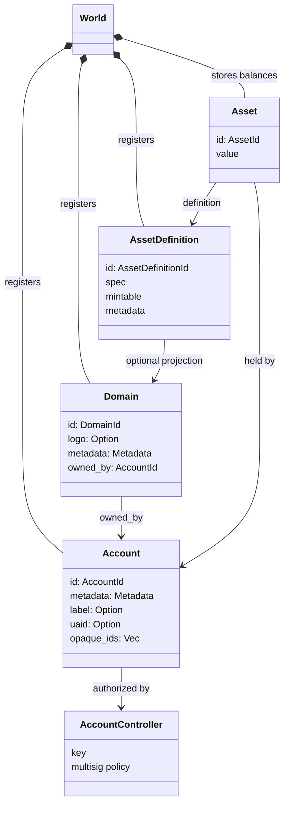
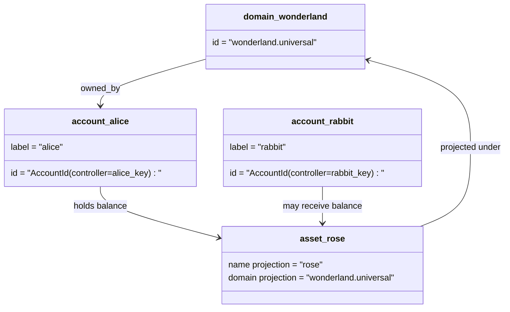

# Data Model

Iroha stores ledger state in the `World`. The current model keeps the same
high-level entities as Iroha 2 while changing several identifiers for Iroha 3
and Nexus flows:

- domains are dataspace-qualified, for example `payments.universal`
- accounts are canonical and domainless; the account ID is derived from the
  account controller
- asset definitions can keep a domain/name projection, but their canonical
  textual address is an opaque Base58 identifier
- assets are balances held by accounts for a specific asset definition

## Example

In an Iroha 3 network, `wonderland.universal` is a domain inside the
`universal` dataspace. `alice` and `rabbit` are not encoded as
`alice@wonderland`; they are canonical accounts controlled by their keys or
policies. A projected asset definition can still be constructed from a domain
and name such as `rose` in `wonderland.universal`, while the canonical asset
definition address used on the wire is the generated Base58 address.

## Related docs

| Topic | Where to go |
| --- | --- |
| Domains | [Domains](/blockchain/domains.md) |
| Accounts | [Accounts](/blockchain/accounts.md) |
| Assets | [Assets](/blockchain/assets.md) |
| Metadata | [Metadata](/blockchain/metadata.md) |
| Registration and transfer instructions | [Instructions](/blockchain/instructions.md) |
| Runtime permissions | [Permissions](/blockchain/permissions.md) |
