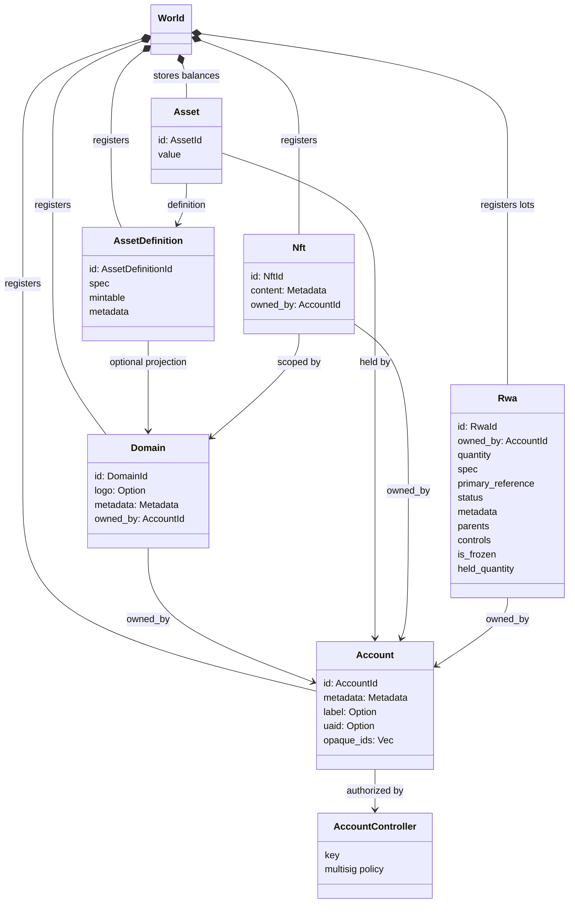
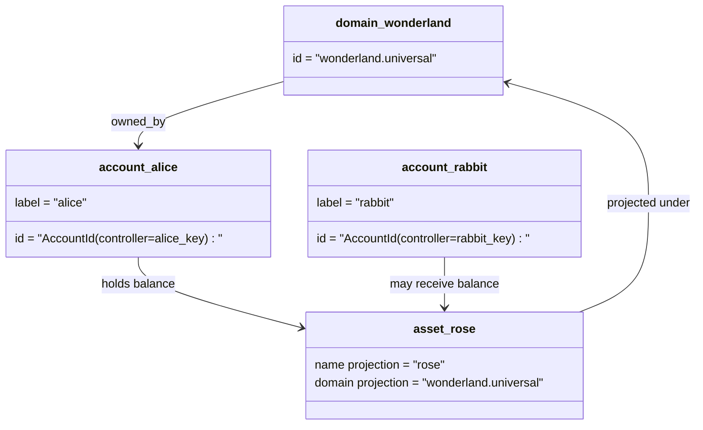

# Data Model

Iroha stores ledger state in the `World`. The current model keeps the same
high-level entities as Iroha 2 while changing several identifiers for Iroha
3 and Nexus flows:

- domains are dataspace-qualified, for example `payments.universal`
- accounts are canonical and domainless; the account ID is derived from the
  account controller
- asset definitions can keep a domain/name projection, but their canonical
  textual address is an opaque Base58 identifier
- assets are balances held by accounts for a specific asset definition
- NFTs are uniquely owned records with domain-qualified IDs and metadata
  content
- RWAs are generated-ID lots that represent off-chain assets with current
  owner, quantity, provenance, metadata, holds, freezes, and lifecycle
  controls

## Example

In an Iroha 3 network, `wonderland.universal` is a domain inside the
`universal` dataspace. `alice` and `rabbit` are not encoded as
`alice@wonderland`; they are canonical accounts controlled by their keys or
policies. A projected asset definition can still be constructed from a
domain and name such as `rose` in `wonderland.universal`, while the
canonical asset definition address used on the wire is the generated Base58
address.

## Aliases

Aliases are human-facing names layered over canonical ledger identifiers.
They are useful at API, CLI, wallet, and explorer boundaries, but canonical
IDs remain the stable identifiers stored in strict ledger fields.

| Target         | Canonical target                                    | Alias literal                                          | Backing model                                                                 |
| -------------- | --------------------------------------------------- | ------------------------------------------------------ | ----------------------------------------------------------------------------- |
| User account   | domainless `AccountId` encoded as an I105 address   | `name@domain.dataspace` or `name@dataspace`            | `AccountAlias`; primary alias is `Account.label`, extra aliases are bindings  |
| Asset definition | canonical `AssetDefinitionId` Base58 address     | `name#domain.dataspace` or `name#dataspace`            | `AssetDefinitionAlias` bound to an asset definition                           |
| Contract       | canonical Bech32m `ContractAddress`                 | `name::domain.dataspace` or `name::dataspace`          | `ContractAlias` bound to a deployed contract address                          |
| Domain name    | `DomainId` in `domain.dataspace` form               | `domain.dataspace`                                    | SNS `domain` namespace record                                                 |
| Dataspace name | numeric `DataSpaceId` from the active Nexus catalog | dataspace alias such as `universal`, `paynet`, or `zk` | SNS `dataspace` namespace record plus the active dataspace catalog            |

Account aliases are the user-facing account names. They survive account
rekeying because the alias points at the active account ID through world-state
indexes and account rekey records. Use `SetPrimaryAccountAlias` for the
account's primary label, `SetAccountAliasBinding` for additional non-primary
aliases, and `FindAccountByAlias` or `FindAliasesByAccountId` for reads.
Account aliases normally require an active SNS account-alias lease acquired
with `AcquireAccountAliasLease` and renewed with `RenewAccountAliasLease`.

Asset aliases name asset definitions, not individual account balances. Asset
aliases and contract aliases are direct bindings from a readable name to an
existing canonical target. Asset aliases are set with `SetAssetDefinitionAlias`;
the alias name segment must match the asset definition display name or
projected definition name. Contract aliases are set with `SetContractAlias`;
the alias dataspace must match the dataspace encoded in the contract address.
Both bindings can carry `lease_expiry_ms`; after expiry they stop resolving
when the grace window elapses and are swept from world-state indexes.

Domains do not have a separate `DomainAlias` object. A domain identifier is
already a dataspace-qualified name such as `payments.universal`. SNS tracks
lease ownership for domain names in the `domain` namespace and for dataspace
aliases in the `dataspace` namespace. The reserved `universal` dataspace alias
must remain defined.

## Related docs

| Topic                                  | Where to go                                 |
| -------------------------------------- | ------------------------------------------- |
| Domains                                | [Domains](/blockchain/domains.md)           |
| Accounts                               | [Accounts](/blockchain/accounts.md)         |
| Assets                                 | [Assets](/blockchain/assets.md)             |
| NFTs                                   | [NFTs](/blockchain/nfts.md)                 |
| Real-world assets                      | [Real-World Assets](/blockchain/rwas.md)    |
| Metadata                               | [Metadata](/blockchain/metadata.md)         |
| Registration and transfer instructions | [Instructions](/blockchain/instructions.md) |
| Runtime permissions                    | [Permissions](/blockchain/permissions.md)   |
| Naming rules                           | [Naming rules](/reference/naming.md)        |
