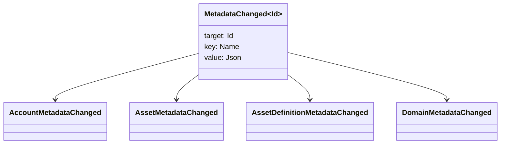

# Metadata

Metadata is a checked key-value map attached to ledger objects. Keys are
`Name` values and values are JSON (`Json`) payloads.

The following objects can carry metadata:

- domains
- accounts
- assets
- asset definitions
- NFTs
- RWAs
- triggers
- transactions

Use metadata for small descriptive or indexing fields that belong in ledger
state. Large payloads should be stored outside the WSV and referenced by a
digest, URI, or SoraFS path.

For guidance on choosing metadata, assets, NFTs, RWAs, or off-chain
storage, see
[Metadata and Ledger Storage Choices](/guide/configure/metadata-and-store-assets.md).

## Try It on Taira

Metadata is visible through normal resource reads. This command lists Taira
asset definitions that currently have metadata:

```bash
curl -fsS 'https://taira.sora.org/v1/assets/definitions?limit=100' \
  | jq '.items[]
    | select((.metadata | length) > 0)
    | {id, name, metadata}'
```

Use the same pattern for domains and accounts:

```bash
curl -fsS 'https://taira.sora.org/v1/domains?limit=20' \
  | jq '.items[] | select((.metadata // {} | length) > 0)'

curl -fsS 'https://taira.sora.org/v1/accounts?limit=20' \
  | jq '.items[] | select((.metadata // {} | length) > 0)'
```

Treat empty output as a valid result. It means the current page of Taira
objects does not carry metadata, not that the endpoint failed.

## Updating Metadata

Metadata is changed with Iroha Special Instructions:

- [`SetKeyValue`](/blockchain/instructions.md#setkeyvalue-removekeyvalue)
  inserts or replaces a key
- [`RemoveKeyValue`](/blockchain/instructions.md#setkeyvalue-removekeyvalue)
  removes a key

The authority submitting the transaction must have the permission required
by the active runtime validator. For the default permission surface, see
[Permission Tokens](/reference/permissions.md).

## Events

Data events are emitted when metadata changes. The generic event payload is
`MetadataChanged<Id>`:



Use [data event filters](/blockchain/filters.md#data-event-filters) to
subscribe only to metadata events for the entity type or object ID that
matters to an integration.

## Queries

Metadata is returned as part of the queried object. For example, use
[`FindAccountById`](/reference/queries.md#accounts-and-permissions),
[`FindDomainById`](/reference/queries.md#domains-and-peers), or
[`FindAssetDefinitionById`](/reference/queries.md#assets-nfts-and-rwas).
Use [`FindNfts`](/reference/queries.md#assets-nfts-and-rwas) or
[`FindNftsByAccountId`](/reference/queries.md#assets-nfts-and-rwas) for
NFTs, and [`FindRwas`](/reference/queries.md#assets-nfts-and-rwas) for RWA
lots. Then read the object's metadata field. NFT query responses expose the
NFT `content` map as the record metadata.

Metadata keys are part of the ledger state, so keep them stable and avoid
encoding application-specific version churn into the key name when a JSON
value can carry that version explicitly.
