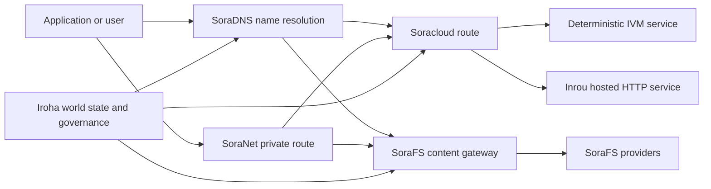

# SORA Nexus Services

SORA Nexus adds app-facing service planes around Iroha 3. These services are
not separate ledgers. They are anchored by Iroha world state, Norito manifests,
governance records, and Torii route families.

Availability depends on the node build and network profile. Use
[`/openapi`](/reference/torii-endpoints.md#app-and-sora-route-families) on the
target node as the authoritative list of enabled routes.

## Component Map

| Component | Role | Main surfaces |
| --- | --- | --- |
| Soracloud | Application deployment, hosted services, private model/runtime state, and service lifecycle control. | `/v1/soracloud/*`, `/api/*`, `iroha app soracloud ...` |
| Inrou | Soracloud hosted HTTP runtime for service revisions that need a live HTTP plane. | Soracloud runtime config, host capability adverts, replica runtime state |
| SoraNet | Privacy and transport overlay for circuits, relay traffic, VPN, Connect sessions, and streaming routes. | `/v1/connect/*`, `/v1/vpn/*`, SoraNet route metadata |
| SoraFS | Content-addressed storage fabric for manifests, CAR payloads, pinned content, gateway fetches, and proof-of-retrievability flows. | `/v1/sorafs/*`, `/sorafs/*`, `FindSorafsProviderOwner` |
| SoraDNS | Deterministic naming and resolver-attestation layer for SORA-hosted services and content. | `/v1/soradns/*`, `/soradns/*`, resolver directory events |



## Common Flows

### Hosted Split Application

A typical mixed-plane app uses all of the pieces together:

1. Static frontend assets are packaged and pinned through SoraFS.
2. The public host, for example `<app>.sora`, is registered through SoraDNS.
3. Soracloud routes `/api/v1/search` or `/api/v1/stream` to an Inrou HTTP
   service.
4. Soracloud routes `/api/auth` and `/api/v1/user` to deterministic IVM
   handlers.
5. Clients that need privacy can reach the same content or API route through
   a SoraNet circuit.

| Path | Backing plane | Why |
| --- | --- | --- |
| `/` | SoraFS static content | Reproducible content root and gateway caching |
| `/assets/*` | SoraFS static content | Content-addressed assets and manifest proofs |
| `/api/auth*` | Soracloud IVM | Replay-safe auth and wallet challenge state |
| `/api/v1/user*` | Soracloud IVM | Governance-sensitive state mutations |
| `/api/v1/search*` | Soracloud Inrou | Live HTTP service, cache, SSE, or collector state |

### Content Publication

SoraFS publication produces durable artifacts before a name points at them:

1. Build a payload or directory.
2. Pack it into a CAR archive and chunk plan.
3. Build a Norito manifest with pin policy and governance data.
4. Submit the manifest to Torii.
5. Bind the manifest to a SoraDNS name or Soracloud static frontend route.

### Private Fetch or Streaming Route

SoraNet can sit in front of SoraFS or Soracloud:

1. The client resolves the name or manifest.
2. A guard directory or route manifest chooses entry and exit relays.
3. Traffic is padded and sent through the SoraNet circuit.
4. The exit relay reaches the SoraFS gateway, Torii stream, or Soracloud route.

## Check a Target Node

Before using examples from this page, confirm that the route family exists on
the node you are targeting:

```bash
export TORII_URL=https://taira.sora.org

curl -fsS "$TORII_URL/openapi.json" \
  | jq '.paths | keys[] | select(test("^/v1/(soracloud|sorafs|soradns|connect|vpn)/"))'

curl -fsS "$TORII_URL/status" | jq .
```

If `/openapi.json` is not exposed by the profile, try `/openapi`. Exact route
availability depends on build features and network configuration.

### Taira Read-Only Smoke Checks

The public Taira endpoint is useful for read-side checks, but do not use it for
mutating examples unless you are operating an authorized account and intend to
change live state.

```bash
export TORII_URL=https://taira.sora.org

curl -fsS "$TORII_URL/status" \
  | jq '{version: .build.version, peers, blocks, lanes: (.teu_lane_commit | length)}'

curl -fsS "$TORII_URL/v1/connect/status" | jq '{enabled, sessions_active}'

curl -fsS "$TORII_URL/v1/vpn/profile" \
  | jq '{available, relay_endpoint, supported_exit_classes}'

curl -fsS "$TORII_URL/v1/sorafs/storage/state" \
  | jq '{bytes_capacity, bytes_used, pin_queue_depth, por_inflight}'

curl -fsS -H 'Accept: application/json' "$TORII_URL/v1/soracloud/status" \
  | jq '.control_plane | {service_count, services: [.services[] | {service_name, current_version}]}'
```

Taira may expose compatibility or control-plane routes that are not listed in
the OpenAPI path map. Treat `/openapi` as the primary generated API contract,
then confirm any compatibility route directly before documenting it as live.

## Soracloud

Soracloud is the SORA application control plane. It tracks deployment bundles,
service revisions, routing, rollout state, authoritative config entries,
encrypted service secrets, model registry records, private inference sessions,
and runtime receipts.

Soracloud uses two execution planes:

| Execution plane | Runtime | Use it for |
| --- | --- | --- |
| `DeterministicService` | `Ivm` | Auth, vault state, certified reads, ordered mailbox handlers, governance-sensitive mutations |
| `HttpService` | `Inrou` | Live HTTP APIs, collector-heavy work, cache-backed services, SSE, browser-assisted flows |

The control plane is authoritative. Deploy, upgrade, rollback, config, secret,
model, and status commands submit through Torii and read committed world state;
they do not rely on a separate CLI-local mirror. Public routing is
longest-prefix based, so one registered host can split traffic between hosted
HTTP routes and deterministic API routes.

### Scaffold a Split App

The split-app template creates a static frontend plus one hosted live API and
one deterministic vault/API service:

```bash
iroha app soracloud app init \
  --template split-app \
  --app-name solswap_indexer \
  --app-version 0.1.0 \
  --public-host solswap-indexer.sora \
  --output-dir ./apps/solswap-indexer

iroha app soracloud app local-plan \
  --manifest ./apps/solswap-indexer/app_manifest.json

iroha app soracloud app doctor \
  --manifest ./apps/solswap-indexer/app_manifest.json
```

`local-plan` prints the route split, child service manifests, workspace script
paths, and the expected frontend publication mode. `doctor` validates the local
release contract before you involve Torii.

### Deploy and Inspect App State

```bash
export SORACLOUD_TORII_URL=https://<soracloud-enabled-torii>

iroha app soracloud app deploy \
  --manifest ./apps/solswap-indexer/app_manifest.json \
  --torii-url "$SORACLOUD_TORII_URL"

iroha app soracloud app status \
  --manifest ./apps/solswap-indexer/app_manifest.json \
  --torii-url "$SORACLOUD_TORII_URL"
```

For an already deployed service, use service-scoped commands:

```bash
iroha app soracloud status \
  --service-name solswap_indexer_live \
  --torii-url "$SORACLOUD_TORII_URL"

iroha app soracloud rollback \
  --service-name solswap_indexer_live \
  --target-version 0.1.0 \
  --torii-url "$SORACLOUD_TORII_URL"
```

### Config and Secret Material

Soracloud config and secret entries are part of authoritative deployment state.
Deploy, upgrade, and rollback fail closed when required config or secret
bindings are missing or inconsistent with the active manifests.

```bash
iroha app soracloud config-set \
  --service-name solswap_indexer_live \
  --config-name indexer/public_config \
  --value-file ./config/public-config.json \
  --torii-url "$SORACLOUD_TORII_URL"

iroha app soracloud secret-set \
  --service-name solswap_indexer_live \
  --secret-name indexer/api_key \
  --secret-file ./secrets/api-key.envelope.json \
  --torii-url "$SORACLOUD_TORII_URL"
```

Use the CLI help for the exact credential flags required by your profile:

```bash
iroha app soracloud config-set --help
iroha app soracloud secret-set --help
```

## Inrou

Inrou is the hosted HTTP runtime used by Soracloud. An Iroha node with the
embedded Soracloud runtime projects admitted Soracloud state into a local
materialization plan, starts assigned hosted-service replicas as loopback
services, and reports replica runtime state back into the authoritative model.

Use Inrou for workloads that need a live HTTP surface, such as collector-heavy
APIs, SSE streams, cache-backed handlers, or browser-assisted services.

### Runtime Requirements

- Container manifest runtime must be `Inrou`.
- Service manifest execution plane must be `HttpService`.
- `HttpService + Inrou` requires exactly one
  `PersistentRootLeaseVolume` mounted at `/`.
- Replicated Inrou services also need shared service or confidential lease
  storage when they retain mutable shared state.
- Production hosting nodes should advertise real Inrou capacity instead of
  operating only as a proxy.

### Manifest Fragment

The example below shows the shape of the two manifests. It is a fragment, not
a complete deployment bundle.

```jsonc
// container_manifest.json
{
  "schema_version": 1,
  "runtime": { "runtime": "Inrou", "value": null },
  "bundle_path": "/bundles/solswap-indexer.inrou",
  "entrypoint": "/app/bin/launch-indexer.sh",
  "args": [],
  "env": {
    "RUST_LOG": "info"
  },
  "inrou": {
    "schema_version": 1,
    "guest_os": { "guest_os": "DebianSlim", "value": null },
    "guest_images": {
      "x86_64": {
        "kernel_image_path": "/inrou/x86_64/vmlinux",
        "rootfs_image_path": "/inrou/x86_64/rootfs.ext4",
        "initrd_image_path": null
      },
      "aarch64": {
        "kernel_image_path": "/inrou/aarch64/vmlinux",
        "rootfs_image_path": "/inrou/aarch64/rootfs.ext4",
        "initrd_image_path": null
      }
    }
  },
  "lifecycle": {
    "start_grace_secs": 60,
    "stop_grace_secs": 30,
    "healthcheck_path": "/api/indexer/v1/health"
  }
}
```

```jsonc
// service_manifest.json
{
  "schema_version": 1,
  "service_name": "solswap_indexer_live",
  "service_version": "0.1.0",
  "execution_plane": { "execution_plane": "HttpService", "value": null },
  "replicas": 2,
  "route": {
    "host": "solswap-indexer.sora",
    "path_prefix": "/api/v1/search",
    "service_port": 8080,
    "visibility": { "visibility": "Public", "value": null },
    "tls_mode": { "tls": "Required", "value": null }
  },
  "lease_volumes": [
    {
      "volume_name": "root_disk",
      "kind": { "lease_volume": "PersistentRootLeaseVolume", "value": null },
      "storage_class": { "storage_class": "Warm", "value": null },
      "mount_path": "/",
      "max_total_bytes": 8589934592
    },
    {
      "volume_name": "index_state",
      "kind": { "lease_volume": "ServiceLeaseVolume", "value": null },
      "storage_class": { "storage_class": "Warm", "value": null },
      "mount_path": "/var/lib/solswap-indexer",
      "max_total_bytes": 1073741824
    }
  ]
}
```

At runtime, each mounted lease volume is exposed through environment variables
derived from the volume name:

```text
SORACLOUD_LEASE_VOLUME_ROOT_DISK_DIR
SORACLOUD_LEASE_VOLUME_ROOT_DISK_MOUNT_PATH
SORACLOUD_LEASE_VOLUME_INDEX_STATE_DIR
SORACLOUD_LEASE_VOLUME_INDEX_STATE_MOUNT_PATH
```

## SoraNet

SoraNet is the privacy and transport overlay. It provides relay-based routes
for traffic that should not connect directly to the target gateway or service.
The transport design uses entry, middle, and exit relay roles, QUIC transport,
a Noise-based hybrid handshake, capability negotiation, relay directory
metadata, and fixed-size padded cells.

In Nexus deployments, SoraNet can carry content fetches, gateway traffic, VPN
or Connect sessions, and Norito streaming routes. Directory entries can mark
relays that support `norito-stream`, which lets clients prefer routes suitable
for Torii RPC or streaming traffic.

### Streaming Configuration

The Nexus profile enables SoraNet provisioning for streaming routes:

```toml
[streaming]
feature_bits = 0b11

[streaming.soranet]
enabled = true
exit_multiaddr = "/dns/torii/udp/9443/quic"
padding_budget_ms = 25
access_kind = "authenticated"
provision_spool_dir = "./storage/streaming/soranet_routes"
provision_spool_max_bytes = 0
provision_window_segments = 4
provision_queue_capacity = 256
```

Use `access_kind = "read-only"` for content routes that do not require viewer
authentication. Use `authenticated` when the exit relay must enforce tickets or
viewer identity before bridging to Torii or a hosted service.

### SoraNet-Aware SoraFS Fetch

The SoraFS fetch CLI can emit a local proxy manifest and spool SoraNet route
metadata for browser extensions or SDK adapters:

```bash
sorafs_cli fetch \
  --plan artifacts/payload_plan.json \
  --manifest-id 7bb2...9d31 \
  --provider name=alpha,provider-id=9f5c...73aa,base-url=https://gw-alpha.example.org/,stream-token="$(cat alpha.token)" \
  --output artifacts/payload.bin \
  --json-out artifacts/fetch_summary.json \
  --local-proxy-manifest-out artifacts/proxy_manifest.json \
  --local-proxy-mode bridge \
  --local-proxy-norito-spool storage/streaming/soranet_routes \
  --local-proxy-kaigi-spool storage/streaming/soranet_routes \
  --local-proxy-kaigi-policy authenticated \
  --max-peers=2 \
  --retry-budget=4
```

The summary records provider reports, chunk receipts, local proxy metadata, and
the effective route settings used for the fetch.

## SoraFS

SoraFS is the decentralized content-addressed storage fabric. It packages bytes
into deterministic chunks, CAR archives, and Norito manifests that bind content
roots, chunking profiles, pin policies, and governance attestations. Storage
providers advertise capacity and content availability, while gateways verify
manifests and chunk commitments before serving content.

Typical SoraFS uses include static application assets, documentation builds,
zone bundles, model or artifact references, and governance evidence bundles.
The Iroha data model exposes SoraFS gateway events and a
[`FindSorafsProviderOwner`](/reference/queries.md#nexus-data-availability-and-packages)
query for provider ownership resolution.

### Pack, Manifest, Sign, and Submit

```bash
cargo run -p sorafs_car --features cli --bin sorafs_cli -- \
  car pack \
  --input ./dist \
  --car-out artifacts/site.car \
  --plan-out artifacts/site.chunk-plan.json \
  --summary-out artifacts/site.car-summary.json

cargo run -p sorafs_car --features cli --bin sorafs_cli -- \
  manifest build \
  --summary artifacts/site.car-summary.json \
  --manifest-out artifacts/site.manifest.to \
  --manifest-json-out artifacts/site.manifest.json \
  --pin-min-replicas=3 \
  --pin-storage-class=warm \
  --pin-retention-epoch=42

SIGSTORE_ID_TOKEN=$(oidc-client fetch-token) \
cargo run -p sorafs_car --features cli --bin sorafs_cli -- \
  manifest sign \
  --manifest artifacts/site.manifest.to \
  --bundle-out artifacts/site.manifest.bundle.json \
  --signature-out artifacts/site.manifest.sig

cargo run -p sorafs_car --features cli --bin sorafs_cli -- \
  manifest submit \
  --manifest artifacts/site.manifest.to \
  --chunk-plan artifacts/site.chunk-plan.json \
  --torii-url "$TORII_URL" \
  --resolve-submitted-epoch=true \
  --authority=<i105-account-id> \
  --private-key-file ./secrets/authority.ed25519 \
  --summary-out artifacts/site.manifest.submit.json \
  --response-out artifacts/site.manifest.submit.body
```

If `/v1/sorafs/pin/register` is not routed on the target node, the CLI can fall
back to a signed `/transaction` submission and wait for a terminal pipeline
status.

### Verify and Fetch

```bash
cargo run -p sorafs_car --features cli --bin sorafs_cli -- \
  proof verify \
  --manifest artifacts/site.manifest.to \
  --car artifacts/site.car \
  --chunk-plan artifacts/site.chunk-plan.json \
  --summary-out artifacts/site.verify.json

sorafs_cli fetch \
  --plan artifacts/site.chunk-plan.json \
  --manifest-id <manifest-digest-hex> \
  --provider name=primary,provider-id=<provider-id-hex>,base-url=https://gateway.example.org/,stream-token="$(cat provider.token)" \
  --output artifacts/site.fetch.tar \
  --json-out artifacts/site.fetch.json
```

### Proof-of-Retrievability Checks

Operators can inspect and trigger proof checks for storage providers:

```bash
sorafs_cli por status \
  --torii-url "$TORII_URL" \
  --manifest <manifest-digest-hex> \
  --status=failed \
  --limit=20

sorafs_cli por trigger \
  --torii-url "$TORII_URL" \
  --manifest <manifest-digest-hex> \
  --provider <provider-id-hex> \
  --reason=latency_probe \
  --samples=48 \
  --auth-token artifacts/challenge_token.to
```

## SoraDNS

SoraDNS is the deterministic naming layer for SORA services and content. It
normalizes names, anchors resolver directory updates in Iroha, and distributes
signed zone or resolver bundles through SoraFS. Resolvers and gateways verify
resolver attestation documents before trusting discovery metadata.

For browser access, SoraDNS derives gateway hosts from a registered FQDN. The
registered vanity host remains the canonical application origin, while gateway
profiles can expose compatibility hosts for clients that cannot resolve SoraDNS
names directly yet.

### Host Forms

| Form | Example | Purpose |
| --- | --- | --- |
| Vanity origin | `https://<fqdn>/<path>` | Canonical app URL recorded in manifests and release notes |
| Taira browser gateway | `https://<fqdn>.mon.taira.sora.net/<path>` | Public browser access when the alias is active and native SoraDNS resolution is unavailable |
| Torii fallback path | `https://taira.sora.org/soradns/<fqdn>/<path>` | Transitional compatibility gateway when the alias is active |
| Canonical hash gateway | `<base32(blake3(name))>.gw.sora.id` | Deterministic gateway identity and GAR verification |

The `/soradns/<alias>/...` fallback is not the preferred public URL. Tooling,
app manifests, and frontend configuration should prefer the vanity host itself.
If an alias is not active on Taira, the browser gateway or fallback path can
return `404` or fail TLS before application routing starts.

### Derive Gateway Hosts

```ts
import {
  deriveSoradnsGatewayHosts,
  hostPatternsCoverDerivedHosts,
} from "@iroha/iroha-js";

const derived = deriveSoradnsGatewayHosts("docs.sora");
console.log(derived.canonicalHost);
console.log(derived.prettyHost);

const taira = deriveSoradnsGatewayHosts("solswap-indexer.sora", {
  prettySuffix: "mon.taira.sora.net",
});
console.log(taira.prettyHost);

const patterns = [
  derived.canonicalHost,
  derived.canonicalWildcard,
  derived.prettyHost,
];
console.log(hostPatternsCoverDerivedHosts(patterns, derived));
```

GAR payloads should cover the canonical hash host, the canonical wildcard, and
the selected pretty host.

### Fetch a Resolver Directory Snapshot

```bash
curl -i "$TORII_URL/v1/soradns/directory/latest"

soradns_resolver directory fetch \
  --record-url "$TORII_URL/v1/soradns/directory/latest" \
  --directory-url https://gateway.example.org/soradns/directory/latest.car \
  --output ./state/soradns-directory

soradns_resolver rad verify \
  --rad ./state/soradns-directory/rad/resolver-a.norito
```

Gateways should reject resolvers whose resolver attestation document is missing,
expired, unsigned, or not anchored in the latest directory Merkle root.
On a network where no resolver directory has been published yet,
`/v1/soradns/directory/latest` can return `404` even though the route is
enabled.

### Public DNS Delegation

SoraDNS host derivation does not replace regular internet DNS delegation. If a
public DNS name should point at a SoraDNS gateway:

- for subdomains, publish a CNAME to the selected pretty host
- for apex names, use ALIAS/ANAME or A/AAAA records to the gateway anycast IPs
- keep the canonical hash host under the SoraDNS gateway domain for GAR checks

## FHE and UAID

Iroha exposes two FHE-related surfaces for Nexus services:

- `iroha_crypto::fhe_bfv` implements deterministic BFV support for scalar
  ciphertext evaluation. Identifier resolution uses
  `BfvIdentifierPublicParameters` and `BfvIdentifierCiphertext`, where slot 0
  stores the input byte length and later slots store one encrypted byte each.
- Soracloud state and job schemas model FHE ciphertext workloads with
  governance-managed parameter sets, execution policies, ciphertext
  commitments, query envelopes, and disclosure requests.

The BFV identifier path is used for privacy-preserving enrollment. A client can
submit an encrypted identifier to the Torii resolver. The resolver evaluates it
under the active identifier policy, derives an `OpaqueAccountId`, and emits a
receipt. `ClaimIdentifier` then binds that receipt to the UAID attached to the
target account.

The UAID is the identity and capability anchor around that flow. In the data
model, `UniversalAccountId` is hash-backed and displays as `uaid:<hash>`.
Parsers accept either `uaid:<hash>` or the raw 64-hex digest. `Account` and
`NewAccount` include optional `uaid` and `opaque_ids` fields. Runtime
registration enforces a one-to-one UAID-to-account index, rejects duplicate or
colliding opaque identifiers, and rejects opaque identifiers without a UAID.
Whenever a UAID account binding changes, the runtime rebuilds Space Directory
dataspace bindings for that UAID.

Space Directory manifests attach capabilities to a UAID. An
`AssetPermissionManifest` names the UAID, dataspace, activation and optional
expiry epoch, and ordered allow/deny entries scoped by dataspace, program,
method, asset, and AMX role. Evaluation is deny-wins: the first matching deny
rejects the request, otherwise the latest matching allow candidate is checked
against any amount limit. Publishing, expiring, and revoking these manifests is
guarded by `CanPublishSpaceDirectoryManifest`.

For Soracloud FHE state, the implemented schemas are:

| Schema | What it controls |
| --- | --- |
| `SoraStateBindingV1` with `FheCiphertext` | Declares that values under a state key prefix are FHE ciphertexts. |
| `FheParamSetV1` | Names the scheme, backend, modulus chain, polynomial degree, slot count, security target, lifecycle, and parameter digest. |
| `FheExecutionPolicyV1` | Bounds ciphertext size, plaintext size, input/output count, multiplication depth, rotations, bootstraps, and rounding mode. |
| `FheGovernanceBundleV1` | Couples one parameter set with one execution policy for admission validation. |
| `FheJobSpecV1` | Describes deterministic `Add`, `Multiply`, `RotateLeft`, or `Bootstrap` work over ciphertext state keys and commitments. |
| `CiphertextQuerySpecV1` | Queries ciphertext-only state by service, binding, key prefix, result limit, metadata level, and optional inclusion proof. |
| `DecryptionRequestV1` | Requests disclosure for one ciphertext commitment under a decryption-authority policy. |

`FheJobSpecV1::validate_for_execution` checks that the job, execution policy,
and parameter set agree before admission. It also enforces operation-specific
rules: add and multiply need at least two inputs, rotate and bootstrap need
exactly one input, and requested depth, rotation count, bootstrap count, input
count, payload bytes, and deterministic output size must stay within policy
bounds. Ciphertext query results must not return plaintext rows.

UAID is not the ciphertext and not the FHE policy itself. It is the stable
account capability anchor used to find the account, opaque identifier claims,
and Space Directory bindings that authorize a service or dataspace flow. FHE
schemas govern encrypted payload admission and execution separately through
parameter sets, execution policies, ciphertext commitments, and decryption
authority policies.

Relevant Torii surfaces include:

- `/v1/identifier-policies`
- `/v1/identifiers/resolve`
- `/v1/accounts/{account_id}/identifiers/claim-receipt`
- `/v1/identifiers/receipts/{receipt_hash}`
- `/v1/accounts/{uaid}/portfolio`
- `/v1/space-directory/uaids/{uaid}`
- `/v1/space-directory/uaids/{uaid}/manifests`
- `/v1/soracloud/model/run-private`
- `/v1/soracloud/model/run-private/finalize`
- `/v1/soracloud/model/decrypt-output`

The public metadata boundary is explicit in the schemas: UAID bindings, opaque
identifier records, manifest lifecycle, state-key digests, ciphertext sizes,
ciphertext commitments, policy names, parameter-set versions, job operations,
output state keys, and disclosure request metadata can be visible. Identifier
plaintexts, decrypted state, model inputs and outputs, and FHE secret keys are
outside these public query records.

## Operational Checklist

- Confirm enabled service families with `/openapi` on the target Torii node.
- Treat Soracloud deployment manifests, SoraFS manifests, SoraDNS resolver
  directory records, and SoraNet relay directory records as governance-sensitive
  artifacts.
- Use the same SORA Nexus profile consistently across validators in one
  network.
- Keep Inrou root and shared lease volumes in manifests instead of relying on
  ad hoc node-local paths.
- Use SoraFS proof verification before promoting content aliases.
- Monitor SoraNet handshake failures, SoraFS gateway refusals, SoraDNS RAD
  freshness, and Soracloud rollout health.
- For public Taira or Minamoto usage, start with
  [Connect to SORA Nexus dataspaces](/get-started/sora-nexus-dataspaces.md).

See also:

- [Torii endpoints](/reference/torii-endpoints.md)
- [Data event filters](/blockchain/filters.md#data-event-filters)
- [Query reference](/reference/queries.md#nexus-data-availability-and-packages)
