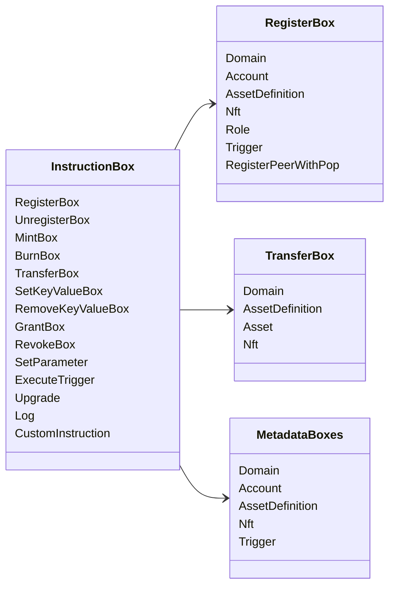

# Iroha Special Instructions

The current data model exposes these built-in instruction families:

| Instruction | Variants |
| --- | --- |
| [`RegisterBox`](/blockchain/instructions.md#un-register) | `Domain`, `Account`, `AssetDefinition`, `Nft`, `Role`, `Trigger`, `RegisterPeerWithPop` |
| [`UnregisterBox`](/blockchain/instructions.md#un-register) | `Peer`, `Domain`, `Account`, `AssetDefinition`, `Nft`, `Role`, `Trigger` |
| [`MintBox`](/blockchain/instructions.md#mint-burn) | numeric `Asset`, trigger repetitions |
| [`BurnBox`](/blockchain/instructions.md#mint-burn) | numeric `Asset`, trigger repetitions |
| [`TransferBox`](/blockchain/instructions.md#transfer) | `Domain`, `AssetDefinition`, numeric `Asset`, `Nft` |
| [`SetKeyValueBox`](/blockchain/instructions.md#setkeyvalue-removekeyvalue) | `Domain`, `Account`, `AssetDefinition`, `Nft`, `Trigger` metadata |
| [`RemoveKeyValueBox`](/blockchain/instructions.md#setkeyvalue-removekeyvalue) | `Domain`, `Account`, `AssetDefinition`, `Nft`, `Trigger` metadata |
| [`GrantBox`](/blockchain/instructions.md#grant-revoke) | permission to account, role to account, permission to role |
| [`RevokeBox`](/blockchain/instructions.md#grant-revoke) | permission from account, role from account, permission from role |
| [`SetParameter`](/blockchain/instructions.md#setparameter) | chain parameter update |
| [`ExecuteTrigger`](/blockchain/instructions.md#executetrigger) | trigger execution |
| [`Upgrade`](/blockchain/instructions.md#other-instructions) | executor upgrade |
| [`Log`](/blockchain/instructions.md#other-instructions) | executor log entry |
| [`CustomInstruction`](/blockchain/instructions.md#other-instructions) | executor-specific JSON payload |

Additional Iroha 3 modules may register domain-specific instruction types
through the instruction registry. For the schema-level list generated from the
current source tree, see [Data Model Schema](./data-model-schema.md).

::: details Diagram: Core Instruction Families

:::
